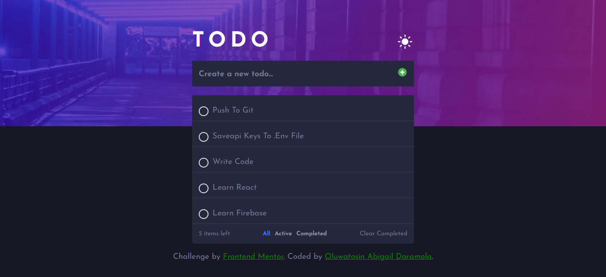

# Frontend Mentor - Todo app solution

This is a solution to the [Todo app challenge on Frontend Mentor](https://www.frontendmentor.io/challenges/todo-app-Su1_KokOW). Frontend Mentor challenges help you improve your coding skills by building realistic projects. 

## Table of contents

- [Overview](#overview)
  - [The challenge](#the-challenge)
  - [Screenshot](#screenshot)
  - [Links](#links)
- [My process](#my-process)
  - [Built with](#built-with)
  - [What I learned](#what-i-learned)
  - [Continued development](#continued-development)
  - [Useful resources](#useful-resources)
- [Author](#author)

## Overview

### The challenge

Users should be able to:

- View the optimal layout for the app depending on their device's screen size
- See hover states for all interactive elements on the page
- Add new todos to the list
- Mark todos as complete
- Delete todos from the list
- Filter by all/active/complete todos
- Clear all completed todos
- Toggle light and dark mode

### Screenshot


### Links

- Solution URL: [Add solution URL here](https://www.frontendmentor.io/challenges/todo-app-Su1_KokOW/hub)
- Live Site URL: [Add live site URL here](https://todo-app-six-tau-35.vercel.app/)

## My process

### Built with

- Semantic HTML5 markup
- CSS custom properties
- Flexbox
- CSS Grid
- Mobile-first workflow
- [React](https://reactjs.org/) - JS library

**Note: These are just examples. Delete this note and replace the list above with your own choices**

### What I learned

```css
/* dark theme */
.wrapper.dark {
    background-image: url("../src/assets/images/bg-mobile-dark.jpg");
    background-color: var(--color-very-dark-blue);
    color: var(--color-dark-dark-grayish-blue);
}

/* Light theme */
.wrapper.light {
    background-image: url("../src/assets/images/bg-mobile-light.jpg");
    background-color: var(--color-very-light-gray);
    color: var(--color-dark-grayish-blue);
}
```
```js
return (
   <>
    <div className={`wrapper ${theme}`}>
    <div className="todo__body">
      <CreateTodo theme={theme} setTheme={setTheme}/>
     <ul className="todo__lists">
      {todos.filter(FILTER_MAP[filter]).map((todo, index)=> {
       return <Todo key={index} todo={todo} toggleComplete={toggleComplete} deleteTodo={deleteTodo}/>
      })}
     </ul>
     
     <FilterSection todos={todos} setTodos={setTodos}  filterList={filterList} setFilterStatus={setFilterStatus}/>
    </div>
    
    </div>
    </>
  );
```


### Continued development

- Firebase
- React
- Saving API keys
- Writing test for code

### Useful resources

- [MUO](https://www.makeuseof.com/how-to-add-dark-mode-to-a-react-application/) - This helped me for theme setting. I really liked this pattern and will use it going forward.
- [Developer Mozilla](https://developer.mozilla.org/en-US/docs/Learn/Tools_and_testing/Client-side_JavaScript_frameworks/React_interactivity_filtering_conditional_rendering#back_to_the_filter_buttons) - This helped me for filtering the buttons. I really liked this pattern and will use it going forward.
- [Ayush Agarwal Blogs](https://blogs.ayushdev.com/hide-firebase-api-keys-in-reactjs-project-using-environment-variables) - This is an amazing article which helped me finally understand how to hide API KEYS in .env file. I'd recommend it to anyone still learning this concept.

## Author

- Website - [Oluwatosin A Daramola](https://medium.com/@oluwatosinhephzibah)
- Frontend Mentor - [@Heph-zibah](https://www.frontendmentor.io/profile/Heph-zibah)
- Twitter - [@undaunted_pen](https://twitter.com/undaunted_pen)

